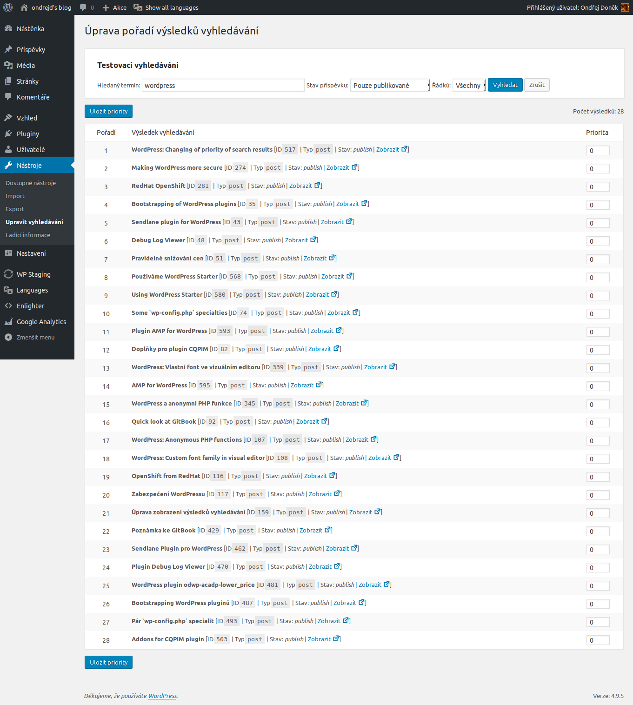

# Úprava řazení výsledků vyhledávání

_For English version see [README.md][4]._

Plugin pro [WordPress][1], který upravuje řazení výsledků vyhledávání dle priority. Podporuje jak normální [WordPress][1] ale také i  plugin [Relevanssi][2].

Hlavní součástí je nová podstránka v administraci (__Admin__ -> __Nástroje__ -> __Úprava vyhledávání__), kde můžete nastavit váhu jednotlivým stránkám a příspěvkům. Položky s větší váhou budou přednostně zobrazeny na stránce s výskedy vyhledávání.

Video z použití můžete najít v [tomto příspěvku][5] a [tomto novějším příspěvku][6] na mém blogu.

## Dárcovství

Pokud se vám tento plugin líbí a chcete podpořit jeho vývoj, můžete zvážit, zda vývojáři neposlat dar pomocí služby

[][3]

## Popis pluginu

### Nastavení priorit

Jak vidíte na obrázku níže, nastavení priorit je opravdu snadné:

[1]:https://wordpress.org/
[2]:https://www.relevanssi.com/
[3]:https://www.paypal.me/ondrejd
[4]:README.md
[5]:https://ondrejd.com/uprava-zobrazeni-vysledku-vyhledavani/
[6]:https://ondrejd.com/plugin-uprava-razeni-vysledku-vyhledavani/