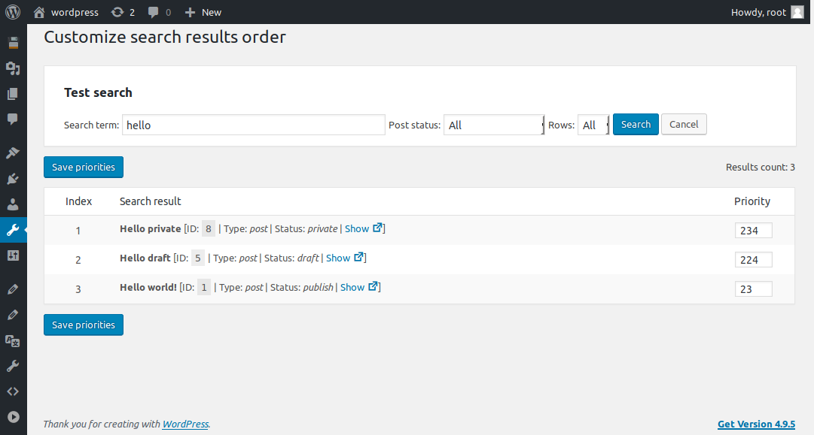
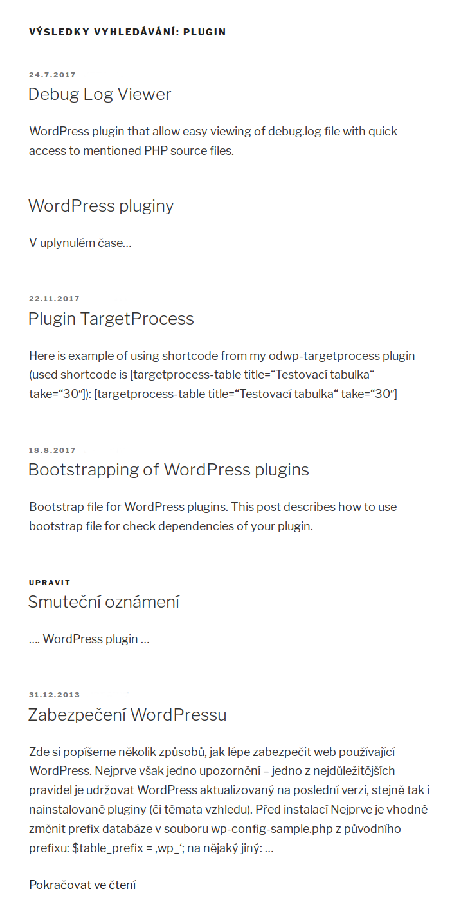

# Customize search results order

_Českou verzi najdete zde [README.cs.md][4]._

[WordPress][1] plugin which customizes order of search results by additional priority value. It supports plain [WordPress][1] as well as plugin [Relevanssi][2].

The main part of the plugin is new administration page (__Admin__ -> __Tools__ -> __Search priorities__) where you can set priority to single pages or posts. Items with higher priority will be shown on top of search results listing.

Screencast with usage of the plugin can be found in [this post][5] on my blog.

## Donations

If your like this plugin and you want to be maintained and improved more frequently consider donation using service

[][3]

## Description

### Setting priorities

As you can see on image below setting priorities is really easy:

### Search results

And here are customized search results (by priorities set on image above):

[1]:https://wordpress.org/
[2]:https://www.relevanssi.com/
[3]:https://www.paypal.me/ondrejd
[4]:README.cs.md
[5]:https://ondrejd.com/en/wordpress-changing-of-priority-of-search-results/