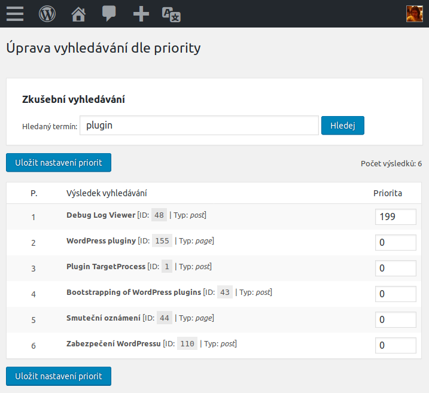
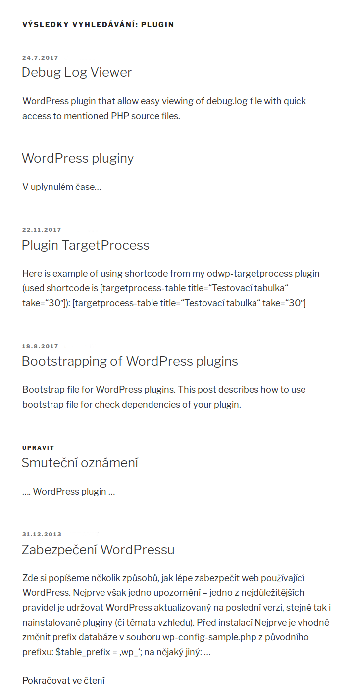

# Úprava zobrazení výsledků vyhledávání

Plugin pro [WordPress][1], který upravuje zobrazení výsledků vyhledávání dle priority. Podporuje buď defaultní chování systému [WordPress][1] nebo plugin [Relevanssi][2].

Hlavní součástí je nová podstránka v administraci (__Admin__ -> __Nástroje__ -> __Úprava vyhledávání__), kde můžete nastavit váhu jednotlivým stránkám a příspěvkům. Položky s větší váhou budou přednostně zobrazeny na stránce s výskedy vyhledávání.

## Nastavení priorit

## Zobrazené výsledky

[1]:https://wordpress.org/
[2]:https://www.relevanssi.com/